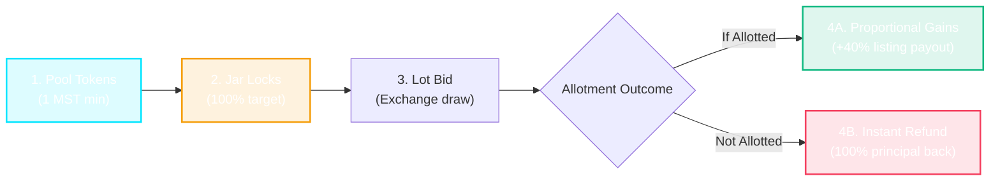

# ⟐ MST OPEN JAR
### *Decentralized SME IPO Fractionalization Protocol*
**Buildathon 2026 Pitch Deck • Simple, Short & Crisp**

---

````carousel
# Slide 1: Title & The Big Hook
## ⟐ MST Open Jar
### Democratizing High-Ticket SME IPO Lots on the MST Blockchain

> **"SME IPOs deliver 30% to 100%+ listing gains. But 90% of retail investors are completely shut out. We fix that with smart contract pooling."**

* **Track**: Web3 FinTech & DeFi
* **Network**: MST Blockchain (Testnet / Chain ID: `1088`)
* **Wallet**: BridgeKey Non-Custodial Wallet
* **Contract**: `0xc743132Ae8e27B8F4dD2E0BF27925eC749f10062`

---
*🗣️ **Speaker Note (20s)**: "Judges, Small and Medium Enterprises are booming, but everyday retail investors can't participate because of one unfair barrier: high-ticket entry sizes. Today, we introduce MST Open Jar to break this barrier forever."*

<!-- slide -->
# Slide 2: The Problem
## The ₹2,00,000 Retail Exclusion Wall

```
┌────────────────────────────────────────┐
│ Mainboard IPO (e.g. Tata Tech, Zomato) │ ──> Min Entry: ~₹14,000 (Accessible to all)
└────────────────────────────────────────┘

┌────────────────────────────────────────┐
│ SME IPO (High Growth, 40%+ Gains)      │ ──> Min Entry: ₹1,50,000 – ₹2,50,000+!
└────────────────────────────────────────┘
```

### The 3 Core Pain Points:
1. **Priced Out**: 90%+ of retail investors cannot afford ₹2 Lakhs for a single speculative SME stock.
2. **Wealth Monopoly**: Multi-bagger listing gains are captured exclusively by HNIs and institutional desks.
3. **No Safe Pooling Mechanism**: Informal pooling leads to scams, trust issues, and manual accounting headaches.

---
*🗣️ **Speaker Note (25s)**: "In regular IPOs, anyone can invest ₹14,000. But SME IPOs force you to buy full lots worth ₹1.5L to ₹2.5 Lakhs upfront. This shuts out 9 out of 10 retail traders, concentrating wealth in the hands of the top 1%."*

<!-- slide -->
# Slide 3: The Solution
## The "Open Jar" Syndication Model

> **Instead of 1 investor risking ₹2,00,000, 100 retail investors pool 1 MST each into an immutable smart contract jar to collectively afford the full lot.**

### Why It Changes Everything:
* 🪙 **Micro-Entry**: Start investing from just **1 MST Token** (1 Fraction).
* 🛡️ **Non-Custodial Escrow**: Tokens are locked in verified smart contracts, not company bank accounts.
* ⚖️ **Zero Allotment Bias**: Every fraction holder receives equal proportional rights and upside.
* 🔄 **Automated 100% Refund**: If the syndicate doesn't get allotted, funds are instantly refunded on-chain.

---
*🗣️ **Speaker Note (25s)**: "MST Open Jar solves this with decentralized syndication. Retailers combine micro-tokens into an Open Jar. Once the target is reached, the jar bids the full lot on exchange with zero counterparty risk."*

<!-- slide -->
# Slide 4: How It Works
## 4 Simple Steps from Micro-Tokens to Listing Day Profits



1. **Micro-Pooling**: Investors contribute MST tokens via `buyFraction()`.
2. **Auto-Lockout**: Pool automatically locks when 100% target is hit; bids lot via `executeLotPurchase()`.
3. **Dual Resolution**: Official exchange lottery draw decides allotment.
4. **Settlement**: 
   - **Allotted**: Gains deposited via `distributeListingGains()` → Proportional profit pulled via `claimReturns()`.
   - **Not Allotted**: 100% principal refunded via `claimReturns()` with zero fees.

---
*🗣️ **Speaker Note (30s)**: "The flow is completely autonomous. You pool 1 MST. If allotted, your proportional share of the listing profit is deposited directly into your wallet. If not allotted, smart contracts return 100% of your tokens instantly."*

<!-- slide -->
# Slide 5: The Math & Profit Distribution
## Trustless Proportional Math

### The Exact Formula:
$$\text{Your Share (\%)} = \frac{\text{Fractions Owned}}{\text{Total Fractions}} \times 100$$
$$\text{Your Payout (MST)} = \text{Share (\%)} \times \text{Total Liquidation Proceeds}$$

### Live Example:
* **Jar Target**: 100 MST (100 Fractions)
* **Your Bet**: 5 MST (5 Fractions = 5% of Lot)
* **Listing Gain**: Stock lists with **+40% gain** (Lot value becomes 140 MST)
* **Your Payout**: $5\% \times 140 = \mathbf{7\text{ MST}}$ *(5 MST principal + 2 MST profit)*

> **Security Highlight**: Built using the **Pull-over-Push Security Pattern** — prevents gas exhaustion and Denial-of-Service when distributing profits.

---
*🗣️ **Speaker Note (25s)**: "There are no hidden deductions. If you own 5% of the jar, you get exactly 5% of the outcome. The pull-payment design guarantees gas safety even with thousands of micro-investors."*

<!-- slide -->
# Slide 6: Live Product & Allotment Transparency
## Institutional Broker Experience (Not a Clumsy Toy)

* **Stock Broker Interface**: Clean Zerodha/Bloomberg dark theme with real-time market ticker tape marquee.
* **BridgeKey Web3 Wallet**: Seamless auto-detection and live balance display (`41.99 tMSTC`).
* **Allotment Desk ("My Allotment Status")**:
  - Official **Allotment Dates** (e.g. `Sep 27, 2026`).
  - **Reason for Succeeded Allotment**: *100% target reached • Valid registrar draw • Full lot allocated.*
  - **Reason for Failed Allotment**: *Oversubscribed in retail category; syndicate not drawn • 100% refund available.*
* **Interactive Lifecycle Simulator**: Dedicated Issuer Console for judges to test the complete lifecycle in 60 seconds!

---
*🗣️ **Speaker Note (25s)**: "Our UI looks and feels like a tier-1 stock broker. In the Allotment Desk, users can clearly see their official draw dates and transparent reasons for why a bid succeeded or failed."*

<!-- slide -->
# Slide 7: Why MST Open Jar Wins
## Market Opportunity & Hackathon Takeaway

| Traditional SME IPOs | MST Open Jar Protocol |
| :--- | :--- |
| **₹1.5L – ₹2.5L** minimum entry barrier | **1 MST Token** micro-fraction entry |
| Exclusively for HNIs & Institutions | Democratized for **100M+ retail traders** |
| Manual, slow refund paperwork | **Instant, non-custodial smart contract refund** |
| High management and brokerage fees | **Micro-protocol fee (0.5%) only on listing profit** |

### 🚀 Summary:
* ✅ **Working Smart Contract** deployed on MST Chain: `0xc743...0062`
* ✅ **Zero-Error Production Build** running live on Next.js 14
* ✅ **Tested with Real BridgeKey Wallet** on MST Testnet

> *"MST Open Jar turns the exclusive SME IPO market into an inclusive, transparent wealth engine for everyone."*

---
*🗣️ **Speaker Note (15s)**: "Judges, this is a working, production-grade protocol addressing a multi-billion dollar market exclusion problem. We are ready to take your questions!"*
````
